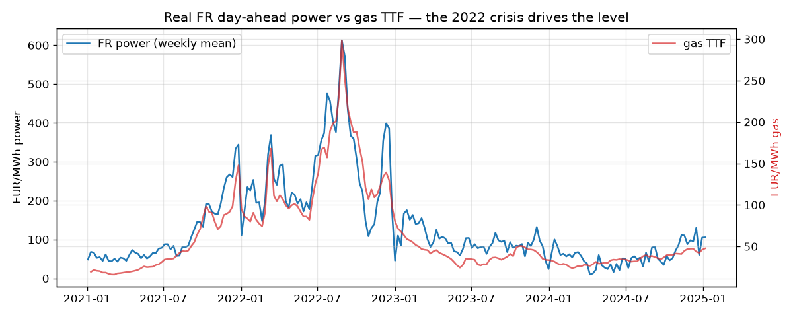
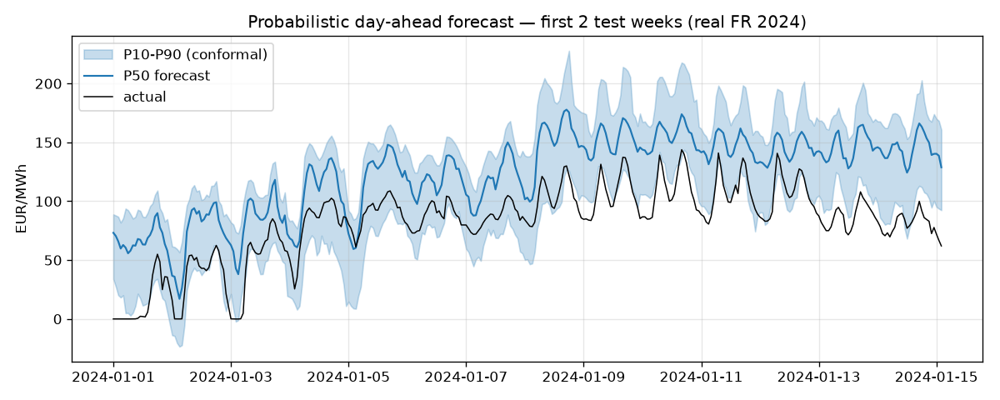
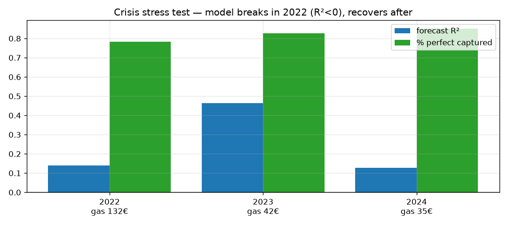
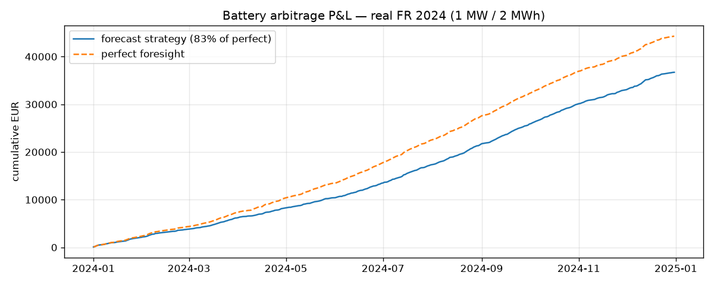
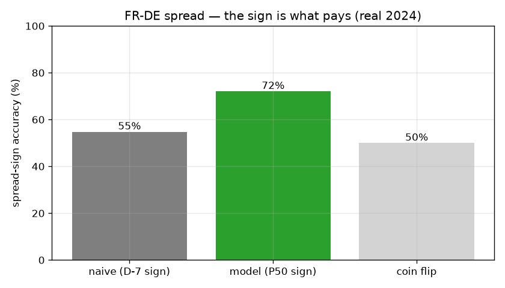

# Battery arbitrage on the FR day-ahead power market

Probabilistic day-ahead price forecast → battery arbitrage LP → P&L backtest with
trader risk metrics. Portfolio piece for energy trading / quant interviews
(TotalEnergies, EDF Trading, Engie GEM, …). Full brief in [HANDOFF.md](HANDOFF.md).

## Locked decisions
| Choice | Pick | Why |
|---|---|---|
| Zone | **FR** | Desk-relevant (Total/EDF), deep liquid data, strong FR↔DE spread |
| Hero strategy | **Battery arbitrage (LP)** | Real asset-optimization desks run daily |
| Forecast | **LEAR + LightGBM quantile** | EPF standard baseline + P10/P50/P90 tails |

## Pipeline
1. **Data** — ENTSO-E: DA price + DA load/wind/solar forecasts, UTC hourly, DST-safe. + gas TTF / CO2 EUA.
2. **Forecast** — naive D-7 + LEAR baselines; LightGBM quantile (α 0.1/0.5/0.9) + **conformal** calibration;
   strict 12:00 D-1 gate; **walk-forward** monthly recalibration.
3. **Trading** — (a) battery LP (`cvxpy`), decisions on forecast settled at realized; (b) FR-DE location spread.
4. **Eval** — P&L, % perfect-foresight captured, Sharpe, VaR/drawdown, spread-sign accuracy, pinball, coverage,
   spike/neg-price recall.

## Results (real ENTSO-E, FR/DE 2021-2024, test = 2024, walk-forward monthly)
| Strategy | metric | model | naive | perfect |
|---|---|---|---|---|
| Battery arbitrage | % perfect captured | **83%** | 78% | 100% |
| FR-DE spread | sign accuracy | **72%** | 55% | 100% |
| | % perfect captured | **91%** | — | 100% |

Forecast (FR 2024 out-of-sample, walk-forward): P50 MAE **25.8 €/MWh** vs naive-D7 **27.8**, R² **0.37**,
DirAcc **0.66**, spike-recall **0.73**; P10-P90 coverage **73%** (conformal, from ~45% raw). Top features:
gas TTF momentum, wind forecast, CO2. The point-forecast edge over naive is modest — **the money is in the
trading layer**: the same forecast captures 83% of perfect on the battery and 72% spread-sign accuracy.

**Crisis stress test (real, train < year → predict year):** in 2022 the model meets the real gas crisis
(price mean **276 €/MWh**, gas TTF **132**) with only ~2 months of legal pre-crisis history — forecast R²
collapses to **0.14** (MAE 85.7), yet the battery still captures **78%** of perfect. Skill recovers as the
crisis enters training (2023 R² 0.46). The trader reading: **P&L capture survives a regime break the point
forecast does not** — read % captured, not R².

A 1 MW price-taker inflates absolute Sharpe (no market impact) — read **% captured / sign accuracy**.
Talking points: [docs/interview_notes.md](docs/interview_notes.md). Full walk-through:
[notebooks/power_trading_quant.ipynb](notebooks/power_trading_quant.ipynb).

## Figures
*(all on real ENTSO-E data; regenerate with `python scripts/make_figures.py`)*

**Fundamentals drive the level — the 2022 gas crisis**


**Probabilistic day-ahead forecast (P10/P50/P90, conformal)**


**Crisis stress test — forecast R² collapses in the 2022 crisis, but battery P&L capture holds**


| Battery arbitrage P&L vs perfect foresight | FR-DE spread — sign accuracy |
|---|---|
|  |  |

## Run
```bash
python run_all.py            # build data -> forecast -> battery + spread verdicts -> dashboard
python run_all.py --single   # single fit instead of walk-forward
python run_all.py --real     # use real ENTSO-E parquet (after token + pull)
```

## Setup
```bash
python3 -m venv .venv && source .venv/bin/activate
pip install -r requirements.txt
python -m pytest -q              # 14 guardrail tests — run inside .venv (needs cvxpy/lightgbm)
cp .env.example .env          # then paste your ENTSO-E API token
python -m src.data.entsoe_pull   # pulls config window -> data/raw/fr_entsoe_raw.parquet
```

## Layout
```
config.py            zone, window, battery specs, quantiles, costs, paths
run_all.py           one-command end-to-end pipeline
notebooks/           power_trading_quant.ipynb  <- the narrative walk-through (start here)
src/data/            entsoe_pull (real) + synthetic (FR+DE) + fundamentals (gas/CO2 via yfinance)
src/forecast/        features (gate-legal), baselines, lear, lgbm_quantile, conformal, tune, scenarios, train
src/trading/         battery_lp (point/robust/CVaR/reserve), spread_strategy, spark_spread, value_stacking, intraday
src/eval/            metrics, trader_metrics, dm_test, strategy_comparison, risk_strategies, regime_test, book_risk, robustness, dashboard
tests/               pytest guardrails (leakage gate, LP feasibility, conformal)
docs/                interview_notes.md
data/raw|processed/  parquet (gitignored)
results/             figures, metrics
```

The notebook [notebooks/power_trading_quant.ipynb](notebooks/power_trading_quant.ipynb) is the recommended
entry point — it tells the whole story (leakage → forecast → 2022 crisis → strategies → risk) with figures.
